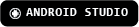

<!--
**santiagoTorres27/santiagoTorres27** is a ✨ _special_ ✨ repository because its `README.md` (this file) appears on your GitHub profile.

Here are some ideas to get you started:

- 🔭 I’m currently working on ...
- 🌱 I’m currently learning ...
- 👯 I’m looking to collaborate on ...
- 🤔 I’m looking for help with ...
- 💬 Ask me about ...
- 📫 How to reach me: ...
- 😄 Pronouns: ...
- ⚡ Fun fact: ...
-->

## Hi there 👋

Hi! I'm Santiago, I'm a software developer and graphic designer based in Madrid, Spain. I love to code, build software, learn new technologies and enhance my skills every day. Here you can see my personal projects and many exercises I've been working on to enhance my knowledge and achieve my goal of working in IT.

## My Skills

### Programming Languages

    
    
    
    

### Frameworks & Technologies

    
    
    
    
    

### Databases

    
        

### Design & Prototyping

    
    
    
    

### Contact me

    
    
    

## This is my GitHub

